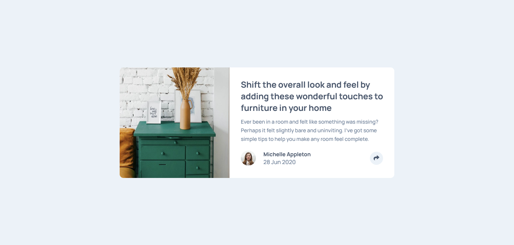
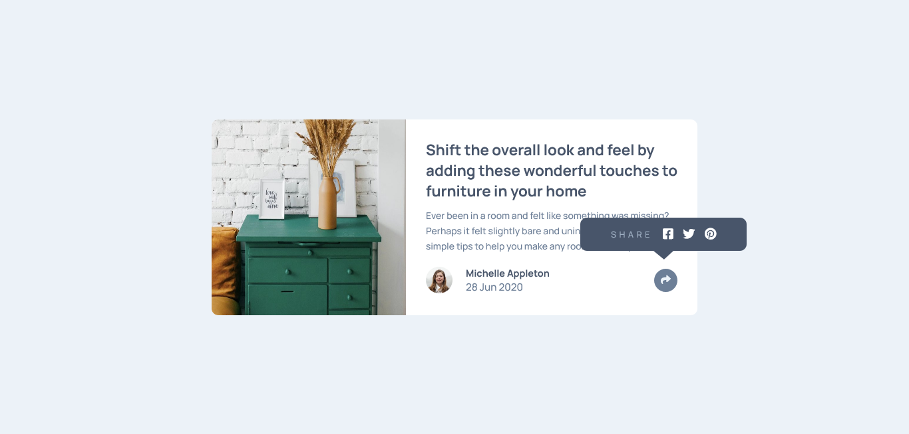
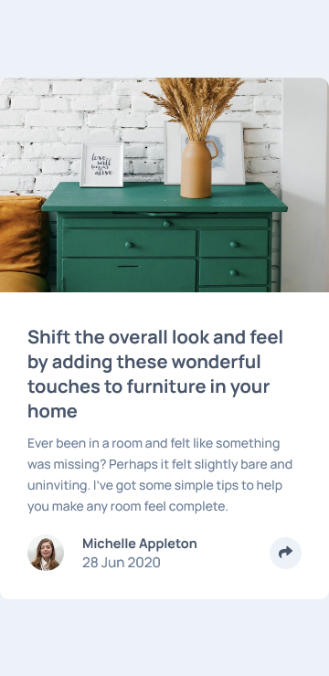
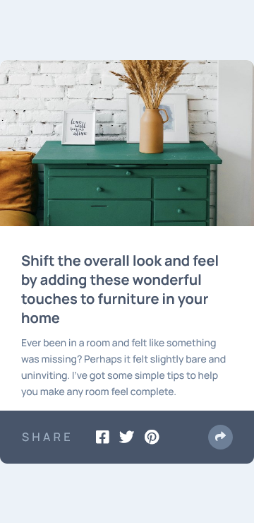

# Frontend Mentor - Article preview component solution

This is a solution to the [Article preview component challenge on Frontend Mentor](https://www.frontendmentor.io/challenges/article-preview-component-dYBN_pYFT). Frontend Mentor challenges help you improve your coding skills by building realistic projects.

## Table of contents

- [Overview](#overview)
  - [The challenge](#the-challenge)
  - [Screenshot](#screenshot)
  - [Links](#links)
  - [Built with](#built-with)
  - [What I learned](#what-i-learned)
  - [Useful resources](#useful-resources)
- [Author](#author)

## Overview

I found this challenge on frontendmentor.io and tried to test my CSS skills

### The challenge

Users should be able to:

- View the optimal layout for the component depending on their device's screen size
- See the social media share links when they click the share icon

### Screenshot

### Links

- Solution URL: [Github](https://github.com/pranto-bapary/article-preview-component)
- Live Site URL: [Add live site URL here](https://pranto-bapary.github.io/article-preview-component)

### Built with

- HTML 5
- SASS
- CSS custom properties
- Flexbox
- CSS Grid
- JavaScript
- Mobile-first workflow
- [Font Awesome](https://fontawesome.com/) - For Icons

### What I learned

By doing this challenge I've learned how to tackle a challenge properly. I've also learned about responsive design,some tricky css positioning,JavaScript DOM manipulation etc.

### Useful resources

- [W3Schools](https://www.w3schools.com/css/css3_flexbox.asp) - This is an amazing article which helped me finally understand Flexbox and Grid. I'd recommend it to anyone still learning this concept.

## Author

- Website - [Pranto Bapary](https://github.com/pranto-bapary)
